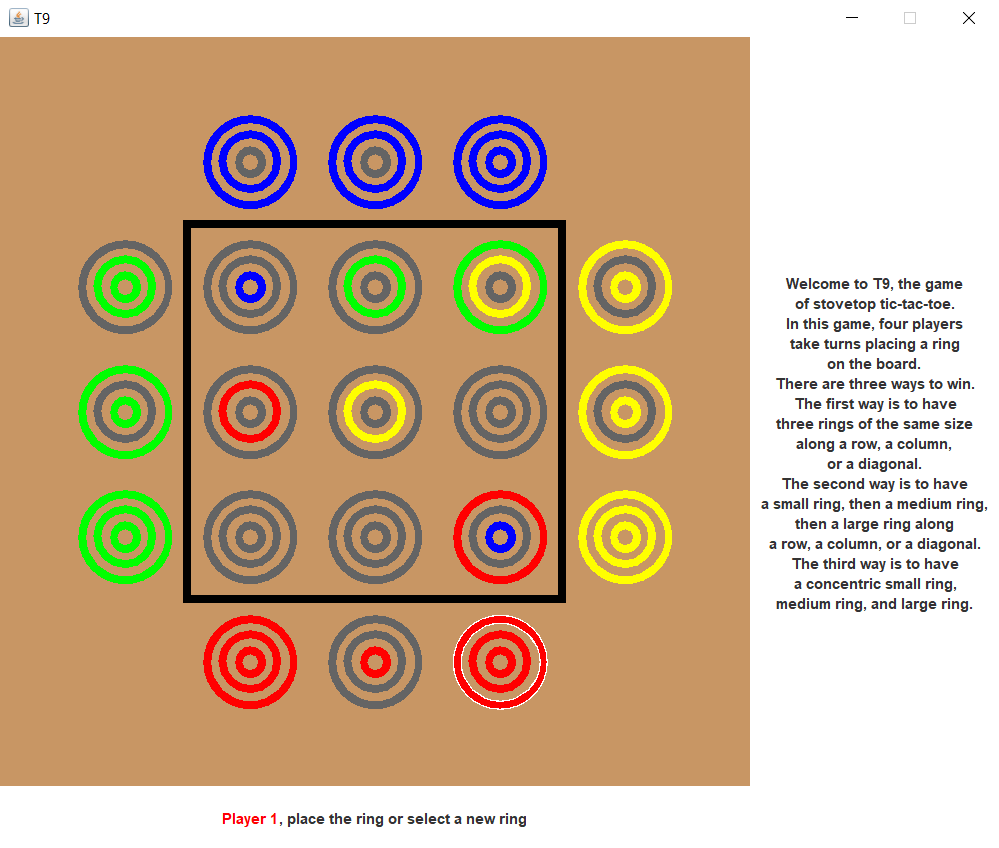

# T9
T9 is a four-player game that is similar to tic-tac-toe. It runs locally (hot seat) and is written in Java.

## TODO
### Features
A "play again" option would be good after a game finishes.  
Adding AI would be a nice feature.  
